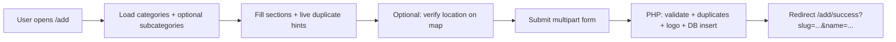

# Add Your Business Listing — Form Flow

This document describes how the **“Add Your Business”** listing form works end-to-end: UI structure, client behavior, API calls, and backend processing. Use it as a baseline when you change the form.

**Primary code:** `frontend/app/add/page.tsx` (`AddBusinessForm` + default page export)  
**Success page:** `frontend/app/add/success/page.tsx`  
**Backend:** `backend-php/routes/business.php` (POST create, duplicate check), `backend-php/lib/Validator.php`, `backend-php/lib/DuplicateCheck.php`, `backend-php/lib/Geocode.php`  
**Routing:** In development, Next.js rewrites `/api/*` to the PHP backend (`frontend/next.config.mjs` → `BACKEND_URL` / `NEXT_PUBLIC_BACKEND_URL` / default `http://localhost:3002`).

---

## 1. Entry points (how users reach the form)

- **Route:** `GET /add` — main page renders `<AddBusinessForm />`.
- **Links:** Header, footer, hero, CTAs (`CtaAddBusiness`, sticky CTA), category/city pages, FAQ, etc., point to `/add`.

---

## 2. High-level user journey

---

## 3. Page layout (form sections, top to bottom)

The form is a **single long `<form>`** with `onSubmit={handleSubmit}` (`noValidate` — browser validation is bypassed in favor of custom rules).

1. **Intro** — Title, description, short “how to add” steps, AdSense slot.
2. **Form completion** — Percentage bar driven by required fields (see §5).
3. **Business information** — Business name (required), contact person (optional), email (required by validation).
4. **Contact information** — Phone and WhatsApp (both required; Pakistan +92 mobile format).
5. **Location & category** — Country fixed to Pakistan (display only), city (`Select` from `cities` in `frontend/lib/mock-data.ts`), optional postal code, category (searchable combobox from API), optional subcategory, full address, optional **“Verify location”** (geocode + map).
6. **Business details** — Description (required, min/max length), logo file (required on client).
7. **Digital presence** — Website and/or Facebook (at least one required), optional GMB and YouTube URLs.
8. **Submit** — Primary button; shows full-page overlay while `submitting`.

**Ads:** Multiple `AdSenseSlot` placements between sections (ids like `add-after-business-info`, etc.).

**Reusable pieces:** `LocationMapConfirm` opens after successful geocode so the user can confirm/adjust coordinates.

---

## 4. Data loading (before and during editing)

### Categories

- On mount: `GET /api/categories?limit=200&nocache=1` — populates searchable category list.
- Results cached in `sessionStorage` under `add:categories` for **1 hour** (`CACHE_TTL_MS`).
- When the category popover opens, categories are fetched again.
- Listening for `storage` event on key `categories:version` and `visibilitychange` refreshes categories/subcategories.

### Subcategories

- When `form.category` changes: `GET /api/categories?slug={slugify(category)}` — fills subcategory options.
- Refreshes when subcategory popover opens.

### Props

- `AddBusinessForm` accepts optional `title`, `description`, `categories` (defaults empty — list comes from API), and `onSubmitted` callback (called after successful submit before navigation).

---

## 5. Client-side state (summary)

| Concern | State / notes |
|--------|----------------|
| Form fields | `FormState`: name, contact, category, subCategory, country (`Pakistan`), city, postalCode, address, phone, whatsapp, email, description, logo file, URLs, optional `profileUsername` (in state; **no visible field** in current UI — only sent if ever set). |
| Errors | `fieldErrors`, `fieldErrorMessages`, `formErrorMessage`, `duplicateWarning`. |
| Submission | `submitting` toggles loading UI and disables submit. |
| Location | `locationLat`, `locationLng`, `showLocationMap`, `geocodeLoading`, `geocodeFailed`. |
| Logo | `logoPreview` (object URL for preview). |

**Completion %:** Computed from: business name, category, country, city, address, phone, description, logo file (8 items). *Note:* Other required items (e.g. WhatsApp, email, website/Facebook pair) are **not** included in this percentage — only the listed fields.

---

## 6. Validation (client)

Triggered in `validate()` before submit.

**Required (non-empty after trim):** business name, category, country, city, address, phone, WhatsApp, email, description; **logo file** must be present.

**Description:** Minimum **500** characters, maximum **1000** (`DESCRIPTION_MIN` / `DESCRIPTION_MAX`).

**Digital presence:** At least one of **website URL** or **Facebook URL** (both validated as URLs if present).

**Pakistan mobile:** Stored as **10 digits** in the form; UI prefixes **+92** on submit. Digits must be exactly 10 and match `^3\d{9}$` (mobile starting with 3).

**Email:** Regex-style check if non-empty.

**URLs:** Optional fields validated with `new URL` (with `https://` prepended when no scheme).

On failure: toast, `fieldErrors` / `fieldErrorMessages` set, scroll/focus first invalid field.

---

## 7. Duplicate detection (client, debounced)

- **Effect:** When name/city/category/phone/whatsapp/email/address/URLs change, after **600 ms** debounce, if enough data exists, the client calls:
  - `POST /api/business/check-duplicates` with JSON (name, city, category, phone with +92, whatsapp, address, email, social URLs).
- **Rate limit (server):** `check-duplicates` — see backend (e.g. 60/min per IP in `business.php`).
- If `hasDuplicates`, a **non-blocking** banner may show; specific **conflicts** can mark fields red with messages (name+city+category, phone, WhatsApp, email, website, Facebook, GMB, YouTube).
- When duplicates clear, duplicate-related field errors are removed.

**Note:** Backend `DuplicateCheck` matches **name + city + category**, **phone_digits**, **WhatsApp**, **email**, normalized **website**, and social URLs — not physical address alone.

---

## 8. Location verification (optional)

- **Button:** “Verify location (recommended)” — disabled without address + city or while loading.
- **Request:** `GET /api/geocode?address=...&city=...&country=Pakistan` (optional `area` — form has no `area` field today, so it is typically omitted).
- On success: lat/lng stored; map dialog (`LocationMapConfirm`) can open; user may adjust pin.
- On failure: toast; submission **still allowed**; copy explains “near me” may suffer until fixed.
- Confirmed coordinates are appended to the create request as `latitude` and `longitude`.

---

## 9. Submit (`handleSubmit`)

1. `preventDefault`; run `validate()`; if invalid, stop.
2. Build **`FormData`** (multipart):
   - Text fields: `name`, optional `contactPerson`, `category`, optional `subCategory`, `country`, `city`, optional `postalCode`, `address`, `description`.
   - Phone fields: `+92` + 10-digit local `phone` / `whatsapp`.
   - Optional: `email`, `websiteUrl`, `facebookUrl`, `gmbUrl`, `youtubeUrl`, `profileUsername`.
   - File: `logo` (if selected).
   - Optional: `latitude`, `longitude` if set.
3. **`POST /api/business`** with `body: fd` (no manual `Content-Type` — browser sets boundary).

---

## 10. Backend: create listing (`POST /api/business`)

Order of operations in `backend-php/routes/business.php`:

1. **Rate limit:** `business-create` (e.g. **10** per IP window — see `RateLimit::check`).
2. Read **`$_POST`** + **`$_FILES['logo']`**.
3. Normalize URL fields: prepend `https://` if missing scheme.
4. Reject description containing the substring **`Business Not Found`** (spam/guard).
5. **`Validator::validateCreateBusiness`** — must pass (see §11).
6. **Coordinates:** If valid `latitude`/`longitude` in range → `location_verified = true`. Else **server-side geocode** via `Geocode::geocodeAddress(address, city, area, country)`; if that returns coords, use them and mark verified.
7. **`DuplicateCheck::check`** — if any conflict → **409** with `conflicts` object (same shape client expects).
8. **Logo:** If valid upload → `CloudinaryHelper::upload` → store `logo_url` / `logo_public_id` (insert can proceed with null logo if upload missing/failed — **client always sends a file**, but server does not require logo in `Validator`).
9. **Slug:** From normalized business name; ensure uniqueness with numeric suffix if needed.
10. **`INSERT` into `businesses`** — status **`approved`**, `approved_by` **`auto`**, timestamps set; category counter incremented; **GooglePing::pingSitemap**; **Email::sendConfirmation** with listing summary.
11. Response **201** JSON: `ok`, `id`, `slug`, `business: { id, slug, name }`.

---

## 11. Server validation (`Validator::validateCreateBusiness`)

Aligns with the client rules in spirit:

- Required: name (max length), category, country, city, address (max length), phone, WhatsApp, email (filter_var).
- Description: **500–2000** characters (client max is 1000 — **intentionally stricter on server max** for description upper bound).
- Pakistan phone: digits must match **`^92[3]\d{9}$`** after normalization for both phone and WhatsApp.
- At least one of **website** or **Facebook**.
- Optional URL fields validated if non-empty; postal code length if provided.

Validation failures → **400** with `details` array (`path`, `message`) — client maps `name` → `businessName`, `logo` → `logo`, etc.

---

## 12. After success (frontend)

- On **2xx** response: reset form state, clear errors, call `onSubmitted?.()`, then:
  - **`router.push`** to `/add/success?slug=...&name=...` if slug returned, else `/add/success`.
- Success page reads `slug` and `name` from query string; shows “Listing submitted successfully”, link to **`/{slug}`** public listing, and options to add another or go home.

---

## 13. Error handling (submit failure)

- **409:** Map `conflicts` to field-level messages (same family as duplicate check).
- **400:** Parse `details` array for field paths.
- Other: show `data.error` or generic connection message; toast destructive.

---

## 14. Static export note

If **`NEXT_PUBLIC_STATIC_EXPORT`** is set, Next may use `output: "export"` — **API rewrites do not apply** in that mode. The add flow expects a live `/api` backend (same origin or configured proxy) for production.

---

## 15. Quick reference — API touchpoints for this form only

| Method | Endpoint | Role |
|--------|----------|------|
| GET | `/api/categories?limit=200&nocache=1` | List categories |
| GET | `/api/categories?slug=...` | Subcategories for selected category |
| POST | `/api/business/check-duplicates` | Debounced duplicate preview |
| GET | `/api/geocode?...` | Optional map / lat-lng |
| POST | `/api/business` | Create listing (multipart) |

---

*Generated from the current codebase for maintenance and product iteration.*
